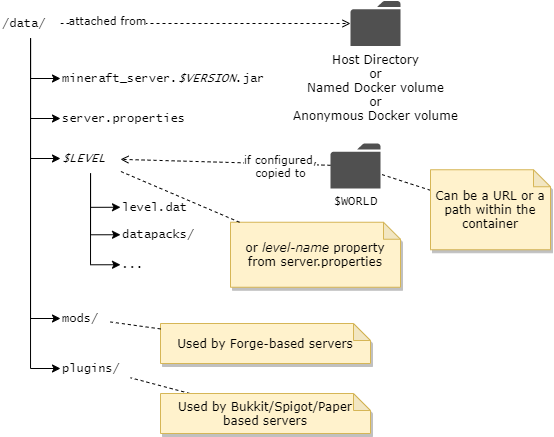

Everything the container manages is located under the **container's** `/data` path, as shown here:



!!! note

    The container path `/data` is pre-declared as a volume, so if you do nothing then it will be allocated as an anonymous volume. As such, it is subject to removal when the container is removed. 

### Attaching data directory to host filesystem

In most cases the easiest way to persist and work with the minecraft data files is to use the [volume mounting](https://docs.docker.com/storage/volumes/) `-v` argument to map a directory on your host machine to the container's `/data` directory. In the following example, the path `/home/user/minecraft-data` **must be** a directory on your host machine:

    -v /home/user/minecraft-data:/data
       ------------------------- -----
        |                         |
        |                         +-- must always be /data
        |
        +-- replace with a directory on your host machine

When attached in this way you can stop the server, edit the configuration under your attached directory and start the server again to pick up the new configuration.

With Docker Compose, setting up a host attached directory is even easier since relative paths can be configured. For example, with the following `docker-compose.yml` Docker will automatically create/attach the relative directory `minecraft-data` to the container.

``` yaml title="docker-compose.yml"
version: "3"

services:
  mc:
    image: itzg/minecraft-server
    ports:
      - 25565:25565
    environment:
      EULA: "TRUE"
    tty: true
    stdin_open: true
    restart: unless-stopped
    volumes:
      # attach a directory relative to the directory containing this compose file
      - ./minecraft-data:/data
```

!!! note

    if you have SELinux enabled, then you might need to add `:Z` to the end of volume mount specifications, [as described here](https://prefetch.net/blog/2017/09/30/using-docker-volumes-on-selinux-enabled-servers/).

### Converting anonymous `/data` volume to named volume

If you had used the commands in the first section, without the `-v` volume attachment, then an anonymous data volume was created by Docker. You can later bring over that content to a named or host attached volume using the following procedure.

!!! note 

    In this example, it is assumed the original container was given a `--name` of "mc", so change the container identifier accordingly.
    
    You can also locate the Docker-managed directory from the `Source` field obtained from `docker inspect <container id or name> -f "{{json .Mounts}}"`

First, stop the existing container:

``` shell
docker stop mc
```

Use a temporary container to copy over the anonymous volume's content into a named volume, "mc" in this case:

``` shell
docker run --rm --volumes-from mc -v mc:/new alpine cp -avT /data /new
```

Now you can recreate the container with any environment variable changes, etc by attaching the named volume created from the previous step:

``` shell
docker run -d -it --name mc-new -v mc:/data -p 25565:25565 -e EULA=TRUE -e MEMORY=2G itzg/minecraft-server
```

### Locating filesystem path of anonymous volume

The `Source` field from the output of this command will show where the anonymous volume is mounted from:

``` shell
docker inspect -f "{{json .Mounts}}" CONTAINER_NAME_OR_ID
```

!!! note

    On Windows with WSL the volumes path is `\\wsl$\docker-desktop-data\data\docker\volumes`
