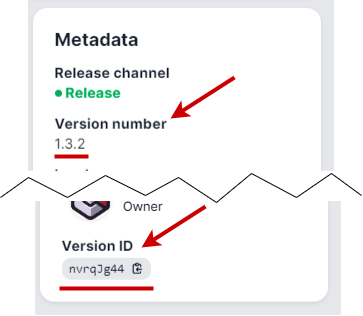

# Modrinth Modpacks

[Modrinth Modpacks](https://modrinth.com/modpacks) can automatically be installed along with the required mod loader (Forge or Fabric) by setting `MOD_PLATFORM` or `TYPE` to "MODRINTH". Upgrading (and downgrading) takes care of cleaning up old files and upgrading (and downgrading) the mod loader.

The desired modpack project is specified with the `MODRINTH_MODPACK` environment variable and must be one of:

- The project "slug", which is located in the URL shown here:

  
- The project ID, which is located in the bottom of the left panel, shown here

  
- The project page URL, such as <https://modrinth.com/modpack/cobblemon-fabric>. As described below, this can further be the page URL of a modpack's version page.

The automatic modpack version resolving can be narrowed in a few ways:

The latest release or beta version, respectively, of the Modrinth modpack is selected when `VERSION` is "LATEST" or "SNAPSHOT". That can be overridden by setting `MODRINTH_DEFAULT_VERSION_TYPE` to "release", "beta", or "alpha".

Furthermore, the resolved modpack version can be narrowed by setting `VERSION` to a specific Minecraft version, such as "1.19.2".

The selected version can also be narrowed to a particular mod loader by setting `MODRINTH_LOADER` to either "forge", "fabric", or "quilt".

Instead of auto resolving, a specific version of modpack file can be specified by passing the version's page URL to `MODRINTH_MODPACK`, such as <https://modrinth.com/modpack/cobblemon-fabric/version/1.3.2> or by setting `MODRINTH_VERSION` to the version ID or number located in the Metadata section, as shown here

